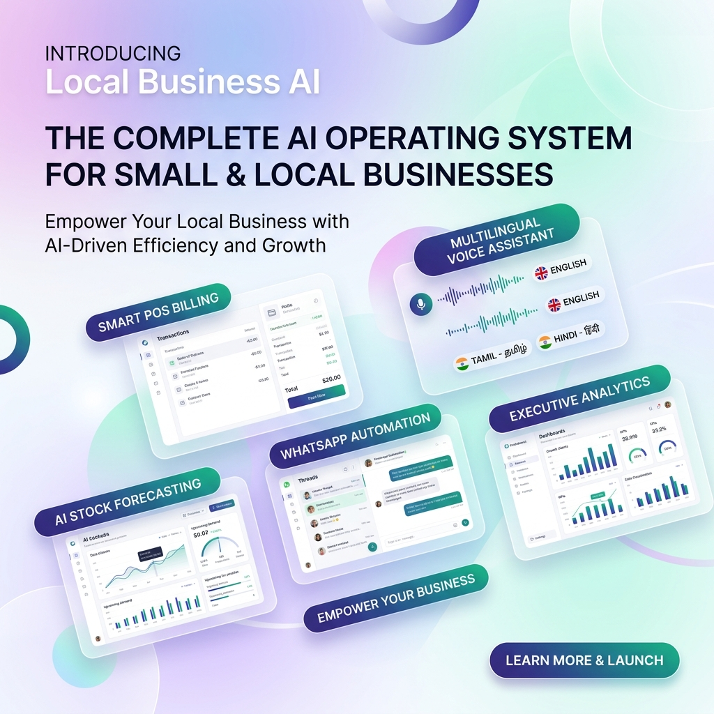
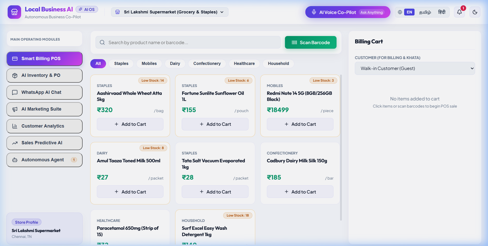
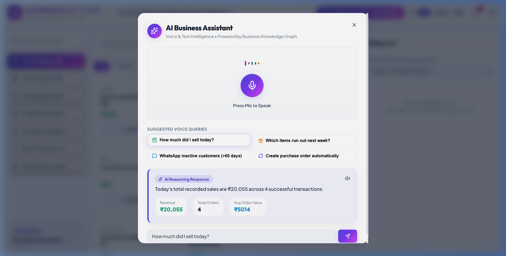
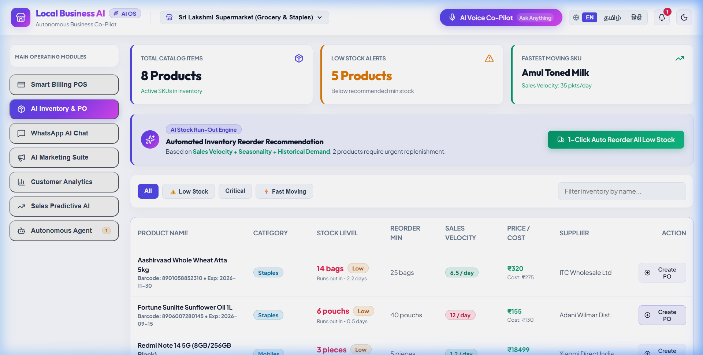
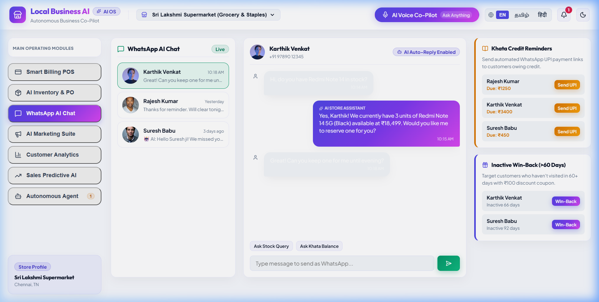
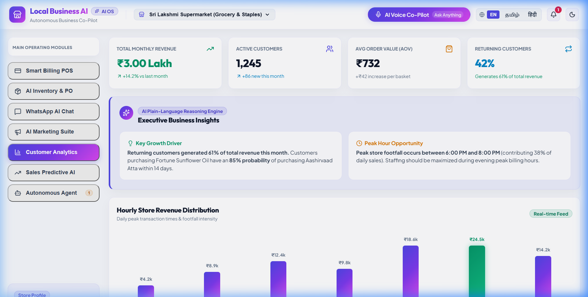

# 🏪 Local Business AI — Autonomous AI Operating System for Small & Local Businesses


A **complete AI operating system for small and local businesses** — combining billing, inventory, customer communication, marketing, analytics, and AI automation in one unified platform.

---

## 📢 LinkedIn Project Launch Showcase


---

## 📸 Light Theme Interface Showcase

### 1. 💳 Smart POS Billing Register (Light Mode)


---

### 2. 🎙️ Multilingual AI Voice Co-Pilot Assistant (Light Mode)


---

### 3. 📦 AI Inventory & Automated Stock PO Predictor (Light Mode)


---

### 4. 💬 WhatsApp AI Business Chat Simulator (Light Mode)


---

### 5. 📊 Customer Analytics & Executive Insights (Light Mode)


---

## 💡 Concept & Core Vision

> **"An AI employee for every local business."**

Instead of fragmented single-purpose apps, **Local Business AI** powers day-to-day operations through a central **Business Knowledge Graph** and **Multilingual Voice Assistant**.

```text
                 LOCAL BUSINESS AI
                        │
       ┌────────────────┼────────────────┐
       ↓                ↓                ↓
    BILLING          INVENTORY        CUSTOMERS
       │                │                │
       └────────────────┼────────────────┘
                        ↓
                   AI ENGINE
                        │
       ┌────────────────┼────────────────┐
       ↓                ↓                ↓
    MARKETING       PREDICTION       AUTOMATION
       │                │                │
       └────────────────┼────────────────┘
                        ↓
                  VOICE ASSISTANT
```

---

## 🚀 Key Modules & Capabilities

### 1. 🎙️ Multilingual AI Voice Assistant
The business owner can ask naturally in **English**, **Tamil**, or **Hindi**:
* *"How much did I sell today?"* / *"நேத்து எவ்வளவு sales ஆச்சு?"*
* *"Which products will run out next week?"* / *"எந்த பொருள் Stock கம்மியா இருக்கு?"*
* *"Send a WhatsApp message to customers who haven't purchased in 60 days."*
* *"Create tomorrow's purchase order."*

### 2. 💳 Smart POS Billing & Invoicing
* High-speed barcode scanner simulation & product category filters.
* 5% HSN GST calculation, Khata credit ledger assignment, and custom discounts.
* **AI POS Upsell Layer**: Recommends high-margin cross-sell products at checkout based on customer purchase history.
* Instant printable & downloadable GST tax receipts.

### 3. 📦 AI Inventory & Demand Predictor
* Real-time stock velocity calculation: `Days Remaining = Current Stock / Daily Velocity`.
* Automatic stock exhaustion alerts.
* 1-Click Purchase Order (PO) auto-creation with supplier assignment.

### 4. 💬 WhatsApp AI Assistant Simulator
* Live customer inquiry auto-responder (e.g. stock availability for Redmi Note 14 5G).
* 1-Click **Khata Credit Payment Reminders** with instant UPI payment links.
* Automated **Inactive Customer Win-Back** broadcasts with discount coupons.

### 5. 📕 Khata Credit Ledger & Recovery Suite
* Tracks customer credit balances, debt aging analysis, and payment history.
* Automated WhatsApp UPI payment link generator (`upi://pay?pa=store@upi&am=AMOUNT`).

### 6. 📣 AI Marketing Suite & Customer Segmentation
* Segments: VIP, Regular, Inactive (>60 days), Price-Sensitive.
* AI Campaign Copywriter generating tailored WhatsApp, SMS, and Festival sale copy.

### 7. 📊 Analytics & AI Narrative Insights
* Executive KPIs (₹ Sales, Active Customers, AOV, Returning Customer Rate %).
* **AI Plain-Language Explainer**: Narrative insights explaining *why* sales shifted instead of raw numbers.
* Hourly peak footfall distribution charts.

### 8. 📈 Sales & Demand Forecasting Visualizer
* Multi-horizon revenue predictions (7/30 days) with upper & lower confidence boundaries.
* VIP customer churn risk detection index.

### 9. 🤖 Autonomous AI Agent
* Transparent background execution loop: **Detect → Decide → Request Approval → Execute → Verify**.

---

## 🛠️ Technology Stack

- **Frontend Framework**: React 18 + Vite
- **Styling**: Glassmorphism Design System, HSL Color Tokens, Light & Dark Themes
- **Voice Intelligence**: Web Speech API (Speech Recognition + Speech Synthesis)
- **Audio Feedback**: Web Audio API Sound Synthesizer (Cash Register, Scanner Beep)
- **Icons**: Lucide-React
- **PWA**: Service Worker & Offline Cache

---

## ⚡ Quick Start

```bash
# Clone the repository
git clone https://github.com/vijaymahes9080/Local_Business_Ai.git

# Navigate to project directory
cd Local_Business_Ai

# Install dependencies
npm install

# Start local development server
npm run dev
```

Open [http://127.0.0.1:5173](http://127.0.0.1:5173) in your browser.

---

## 📜 License & Author

* **Author**: Vijay Mahes ([Vijaypradhap2004@gmail.com](mailto:Vijaypradhap2004@gmail.com))
* **License**: MIT License — see the [LICENSE](LICENSE) file for details.
